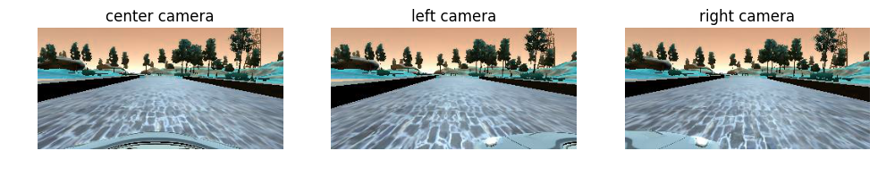
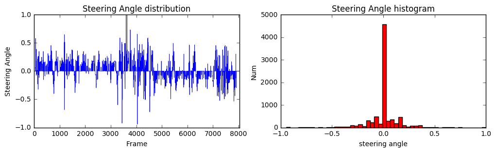
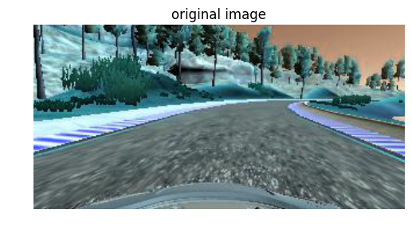
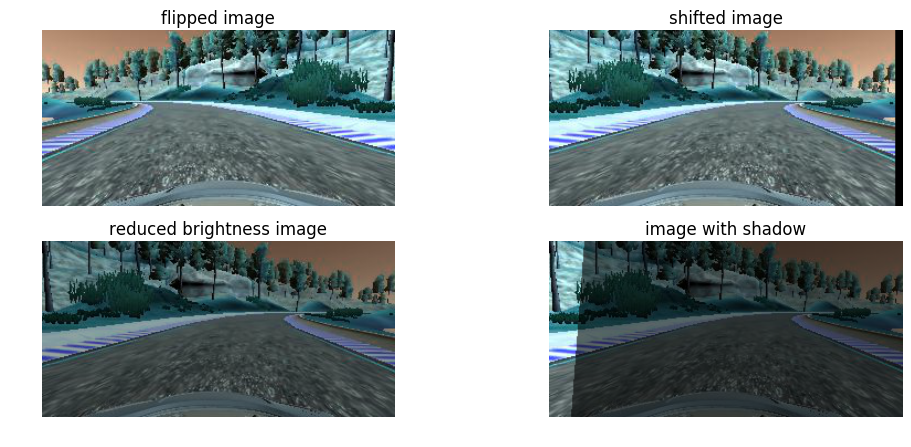
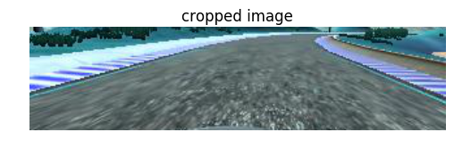

# Project 3: Use Deep Learning to Clone Driving Behavior

## Introduction

The goals / steps of this project are the following:
* Use the simulator to collect data of good driving behavior (or use data given by Udacity)
* Build, a convolution neural network in Keras that predicts steering angles from images
* Train and validate the model with a training and validation set
* Test that the model successfully drives around track one without leaving the road
* Summarize the results with a written report

## Files

The submission contains the following files:
* `src/model.py` : script used to create and train the model
* `src/drive.py` : script to drive the car (hasn't been modified)
* `notebooks/Visualization.ipynb`: a Jupyter notebook with the code for generating the images used for the written report
* `model.h5` : a file with the weights of the trained Keras model
* `video.mp4` : a video with the car driving in track 1, generated with `python video.py video`
* `writeup.md` : a report writeup file

## Understanding Data

I decided to use the Udacity data as a starting point for training the model. My plan was once I had the end-to-end system running, to collect my own data in order to improve the navigation of the car. However, I managed to get the car navigating in Track 1 successfully with the initial dataset, so I didn't collect any additional data.

The dataset consists of:
- `IMG folder` which contains all the frames of the driving, from the center, left and right camera of the car.

- `driving_log.csv file` which in each row contains the path for the images of the three cameras for each frame and correlates that frame with the steering angle, throttle, brake, and speed of the car. For the training of the model only the steering angle parameter was used.

The histogram plot does not show any imbalancing in the dataset.

## Data preprocessing

Although the steering angle distribution does not show any imbalancing in the dataset, the car track is a loop the requires counterclockwise driving most of the time, so the car will not be able to stay on track in cases where it will have to steer to the right with large angle.
To mitigate this problem I applied image flipping and further augmented the data with 3 more image transformations:

- **Image flipping** `(line 45)`
- **Image shifting** `(line 62)`
- **Change brightness** `(line 52)`
- **Image shadow** `(line 77)`

These transformations were applied every time to a random choice between the center, right or left camera. This way the model gets trained on recovery driving, if the vehicle drifts off to the side. When using an image from a side camera, a correction is applied to the angle to force the vehicle to the center of the road when it sees a similar image. For the correction I used a value of 0.22 .

The data is pushed to the model through a generator and images are preprocessed on the fly, making the training process much more memory-efficient.

Finally each image was normalized, mean centered and cropped because the top and bottom pixels were capturing information that wasn't useful for the steering angle prediction, such as the hood of the car, hills, trees and sky. These transformations were applied through a Lambda layer, which ensures that the model will normalize and crop input images when making predictions in drive.py

## Network Architecture

The network architecture that was used is the architecture published by the autonomous vehicle team at NVIDIA. This is the network they use for training a car to drive autonomously ([link](http://images.nvidia.com/content/tegra/automotive/images/2016/solutions/pdf/end-to-end-dl-using-px.pdf)). It consists of a normalization layer, 5 convolutional layers and 3 fully connected layers.

The input image has size 160x320x3 and is passed to the first layer of the network which normalizes images to the range [-0.5, 0.5] `(line 140)`. Performing normalization allows to get small values for mean and equal variance making it easier for the optimizer to go and find a good solution. I also added a cropping layer in Keras `(line 142)` in order to remove any information such as trees and mountains that was not useful for the model.

These layers are followed by convolutional layers are designed to perform feature extraction. Strided convolutions are used in the first three convolutional layers with a 2×2 stride and a 5×5 kernel and a non-strided convolution with a 3×3 kernel size in the last two convolutional layers.

Finally the architecture has three fully connected layers which mainly functions as a controller for steering, but after training the system end-to-end, it is not possible to make a clean break between which parts of the network function primarily as feature extractor and which serve as controller. The output is a single node that predict the value of the steering angle.

After every layer a rectified linear unit (relu) function and a dropout of keeping probability 20% was added. Relu introduced non-linearities, and with the dropout prevents the network from overfitting. Larger probability values were tried, but the model was overfitting very fast.

## Training Strategy

- **Parameter tuning**

For the training of the model I used the Adam optimizer and mean squared error, which is a good loss function for regression problems `(line 177)`. A maximum number of 8 epochs was allowed, because no improvement was noticed after number. Also early stopping was utilized in order to prevent the model from further training when the validation loss was not improving anymore `(line 192)`. In addition, the Keras ModelCheckpoint was used, to store the model weights after every epoch `(line 194)`. This functionality was eventually very useful, because in some cases, although the validation loss kept improving, the corresponding network performance in the simulator was worse when comparing with former epochs.

- **Data feeding**

From the given dataset, 20% is split of for the validation set. Instead of storing the preprocessed data in memory all at once, a generator was used. Data was pushed to the model in batches of 32 images, which were preprocessed on the fly, making the training process much more memory-efficient. In every iteration the data is shuffled `(lines 118, 134)`.

## Simulation

- Track 1

The network performance is evaluated on the simulator provided by Udacity. The model is first tested in Track 1, which was also used for creating the training dataset, and is capable of navigating successfully (without popping up onto ledges or rolling over any surfaces that would otherwise be considered unsafe for humans)

- Track 2

In order to test how well the model generalizes, it was also tested on Track 2, which consists of a more challenging route and of images that haven't been seen by the network before. Although it manages to drive successfully most of the time, at the end of the lap, the car falls on a ledge, which means that I need to further improve the training process.
